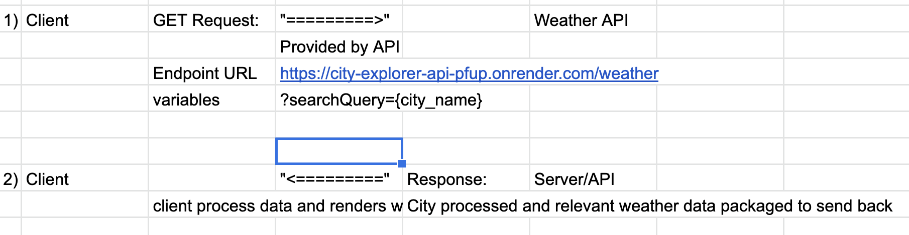
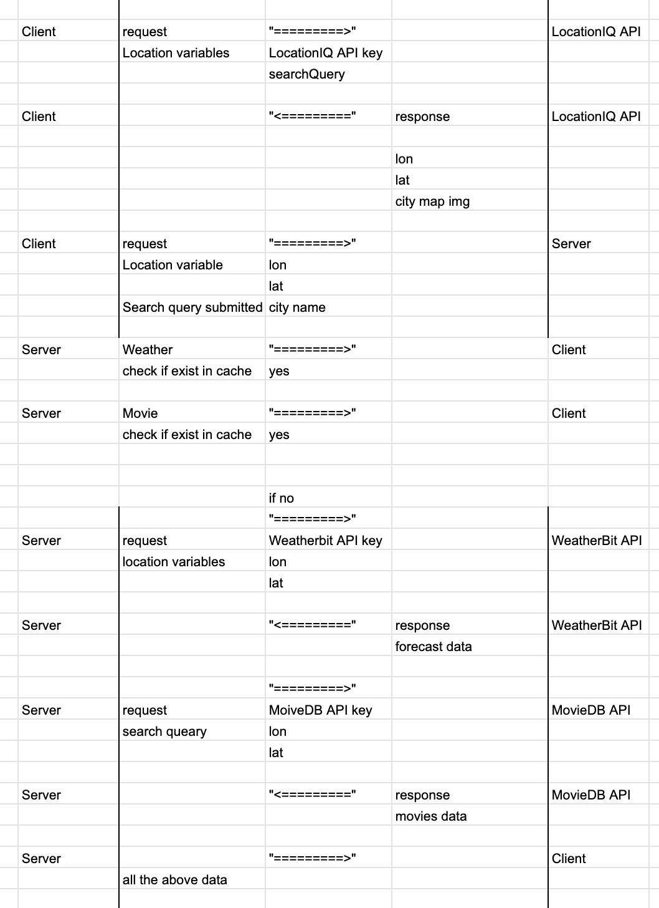

# city-explorer-api

**Author**: Jonathan Tsai
**Version**: 1.3.0 (increment the patch/fix version number if you make more commits past your first submission)

## Overview

This project is an API that provides the backend server for the City Explorer app.

## Getting Started

npm install

## Architecture

This project uses npm, Node.js, Express.JS and dotenv to provide endpoints the API can repond to.

## Change Log
- Implemented backend local server

- Implemented starter code for backend local server for caching

## Credit and Collaborations
<!-- Give credit (and a link) to other people or resources that helped you build this application. -->

Feature: Set up server
Estimated time: 30 mins
Start Time: 12 PM
Finish Time: 12:30 PM
Actual Time: 12:30 PM

Feature: Weather processing
Estimated time: 2 hour
Start Time: 12:30 PM
Finish Time: 2:30 PM
Actual Time: 3 PM

Feature: Error handling
Estimated time: 2 hour
Start Time: 3 PM
Finish Time: 5 PM
Actual Time: 6 PM

Feature: Caching
Estimated time: 4 hours
Start Time: 12 PM
Finish Time: 4:00 PM
Actual Time: 3:30 PM

